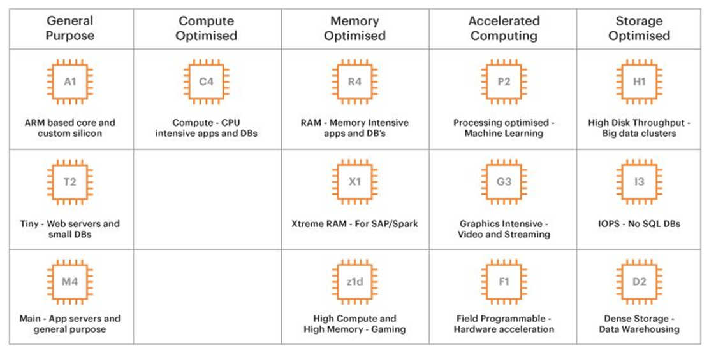
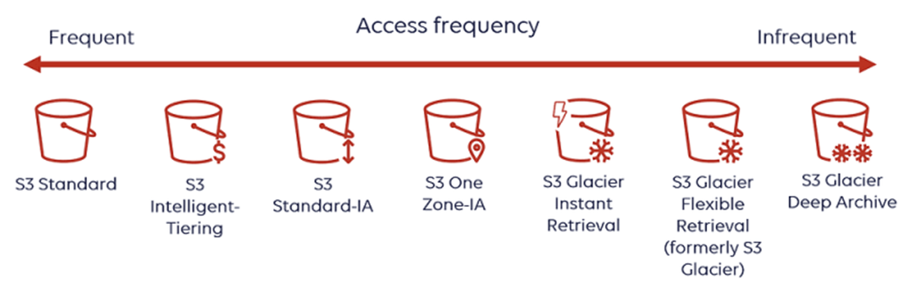
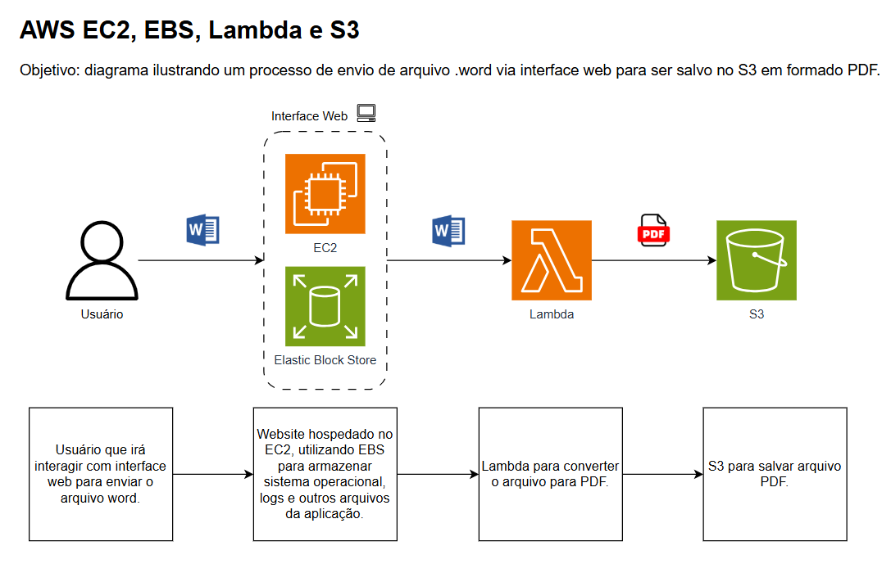

# DIO - Computação na Nuvem com EC2
Repositório para armazenar conhecimentos obtidos no curso DIO Santander Code Girls 2025 - Módulo Computação na Nuvem com EC2.

# EC2
Web service que provê servidores virtuais (instâncias) escaláveis na nuvem para rodar aplicações.

Casos de uso: host de sites, APIs, host de jogos multiplayer.

Possibilita customização de sistema operacional, CPU, memória, disco e rede. Importante entender qual a necessidade de utilização para escolher o EC2 adequado a fim de melhor gerir os gastos.

**AMI (Amazon Machine Image):** feature que permite a criação de imagem de uma instância EC2 a  fim de replicá-la (+EBS).

# EBS - Elastic Block Store
Storage que pode ser anexado ao EC2, aumentando o armazenamento em disco da instância. 

Funciona como um disco rígido/SSD (para armazenar dados persistentes como aplicações, arquivos e bancos de dados).

**EBS Snapshot:** feature que permite criar uma cópia dos dados armazenados em determinado momento a fim de criar um backup. Por exemplo, a cada hora cria um snapshot e armazena no S3.

# S3 - Simple Storage Service
Serviço de armazenamento de objetos em nuvem.

Utilizado para armazenar, organizar e recuperar grandes volumes de dados dentro de buckets.

Possui diferentes opções de armazenamento de acordo com a frequência de utilização das informações armazenadas. Por exemplo, dados acessados com frequência inferior a 90 dias podem ser salvos no S3 Standard enquanto dados a mais de um ano sem acesso podem ser armazenados no S3 Glacier.

# Exemplo de aplicação utilizando EC2, EBS e S3
Um usuário necessita enviar via interface web um arquivo em formato .word para ser salvo no S3 em formato PDF.

